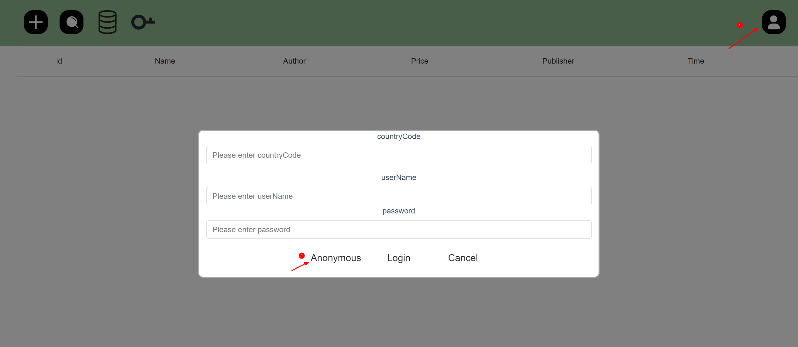
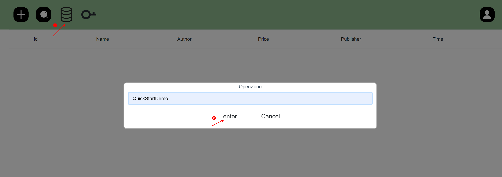
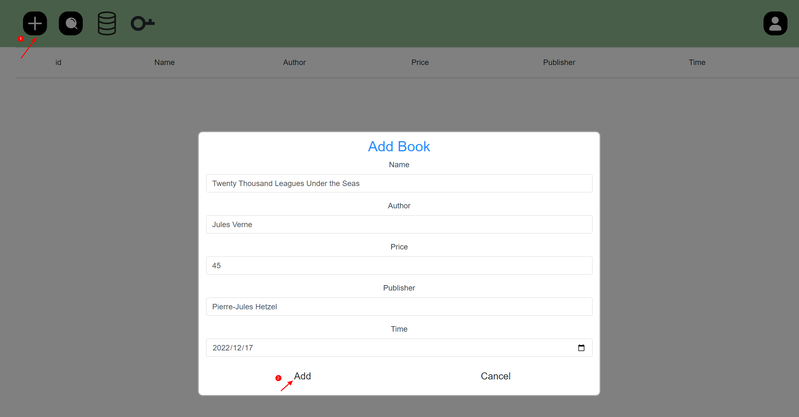
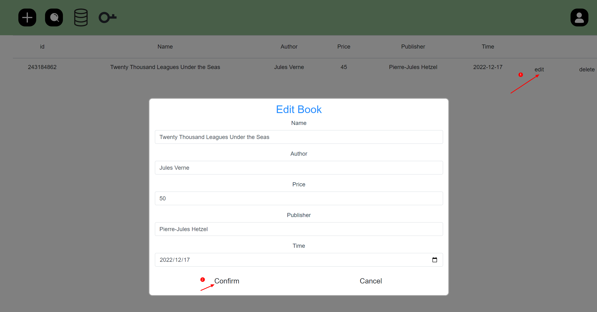
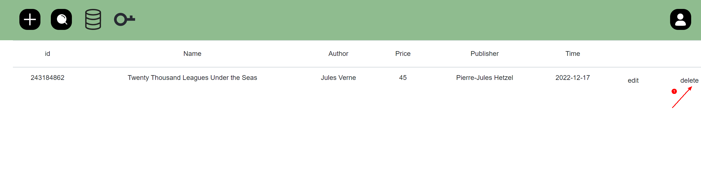
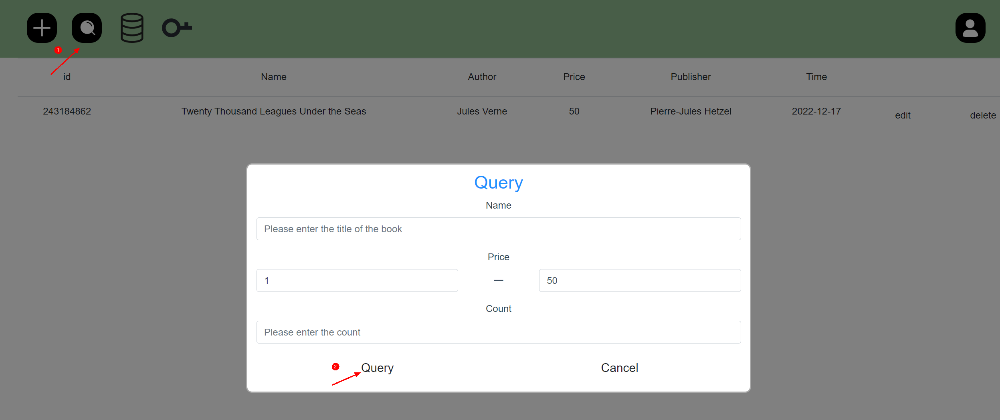

#  Cloud DB JS SDK Demo


## 概要简介
本项目是使用Cloud DB JS SDK开发的快速入门示例。

## 快速开始
- 在[AppGallery Connect](https://developer.huawei.com/consumer/cn/service/josp/agc/index.html#/myProject) 页面上，创建一个项目并添加名为`QuickStartDemo`的web应用。

- 单击导航栏上的**认证服务**，启用匿名帐户身份验证。

- 单击导航栏上的**云数据库**，启用云数据库服务。然后执行以下操作：

    （1）创建对象类型。 
  
  在`对象类型`页面，通过导入**BookInfo.json**文件来创建对象类型，文件路径为`src/components/config/`。或者可以手动创建名为**BookInfo**的对象类型，并保证所有字段和`src/components/model/BookInfo.js`文件保持一致。

    （2）创建存储区。

  在`存储区`页面，**创建名为QuickStartDemo**的存储区。


- 在**项目设置**页面，获取应用配置信息。将其保存到`src/components/config/agconnect-services.js`文件中。

- 集成Cloud DB SDK。

  在根目录下执行以下命令安装Cloud DB JavaScript SDK服务模块。
        
  ```
    npm install
  ```
        
- 运行项目。
        
  ```
    npm run start
  ```

## 操作数据

##### 1. 匿名登录。

  

##### 2. 输入存储区名称`QuickStartDemo`并点击`enter`打开存储区。

  

##### 3. 插入数据。

  

##### 4. 更新数据。

  

##### 5. 删除数据。

  

##### 6. 查询数据。

  
